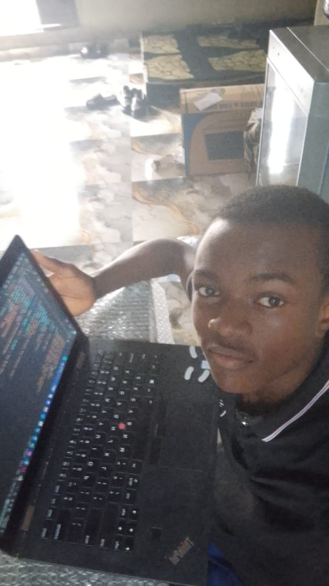

# 

Hi, I'm **Caleb Wodi**.

I build software and ship developer tools.

Most of my work is experimentation. I test ideas, build small systems, and try to understand how things actually work under the hood.

Right now my focus is **depth, fundamentals, and first-principles thinking**. I care less about frameworks and more about understanding the machinery behind them.

## Current Focus

I'm strengthening my foundations in:

- Python for scripting, tooling, and fast experimentation  
- JavaScript for building things on the web

At the same time I'm moving deeper into systems programming:

- C to understand memory, operating systems, and how software actually runs  
- Rust to explore safe systems programming and modern low-level design  
- Go for building reliable network services and developer infrastructure

## What I'm Interested In

- Developer tools  
- Systems programming  
- Networking and protocols  
- Building small tools that solve real problems  
- Learning by building and shipping

Every project I ship is part of the same goal:

**Become a stronger engineer by understanding the foundations of software.**

## Currently Learning

- Building an HTTP server from raw sockets  
- Reading real codebases  
- Writing tools instead of tutorials

## Projects

- [**ExplainThisRepo**](https://explainthisrepo.com): Analyzes repositories and explains the architecture in plain English.

- [**TwitterXScraper**](https://github.com/calchiwo/twitterxscraper): Scrapes tweets and metadata for analysis or archiving.

- [**Auth System From Scratch**](https://github.com/calchiwo/auth-system-from-scratch): Authentication system built from first principles.

- [**FileMapTree**](https://github.com/rojecttechnologies/filemaptree): Generates ASCII file trees from project directories.

## Contact

- Email: calebwodi33@gmail.com
- LinkedIn: [Caleb Wodi](https://www.linkedin.com/in/calchiwo)
- Medium: [@calchiwo](https://medium.com/@calchiwo)
- X: [@calchiwo](https://x.com/calchiwo)
- YouTube: [@calchiwo](https://youtube.com/@calchiwo)
- Discord: [Caleb Wodi](https://discord.gg/y3a2dFgA)

## Profile Views

 

